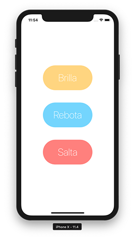

# TUTORIAL Swift 4 - EXTENSIONES y ANIMACIONES en iOS | Español | MoureDev by Brais Moure Brais Moure YouTube channel

**`¡HOLA HACKERMEN! 👋🏼`**

Bienvenidos al canal de [YouTube](https://www.youtube.com/channel/UCxPD7bsocoAMq8Dj18kmGyQ) ***MoureDev by Brais Moure***. 

Soy Brais Moure, desarrollador de software freelance. Comparto tutoriales sobre desarrollo de aplicaciones **iOS** y **Android**.

Si te interesa el desarrollo de apps **`SUSCRÍBETE Y ACTIVA LA CAMPANA 👆🏼`** [Puedes hacerlo aquí 👈🏼](https://www.youtube.com/channel/UCxPD7bsocoAMq8Dj18kmGyQ?sub_confirmation=1)

## Descripción
Las extensiones nos ayudarán a ampliar la funcionalidad de nuestros componentes y clases, para poder reutilizar a lo largo de nuestro código y reducir tiempos de desarrollo.

Tutorial para trabajar con extensiones (Extension) en Swift. En este ejemplo trabajo creando una extensión de UIButton para poder modificar su aspecto y dotarlo con animaciones al pulsar en él.

## Videotutorial

## Requisitos
* [Xcode](https://developer.apple.com/xcode/) 9.4
* Swift 4
* iOS 11.x o superior (Compatible con iPhone y iPad)

## Recursos
* [Cómo crear un proyecto iOS en Xcode](https://youtu.be/mdrSGhNeOwQ)

## ¿Te gusta el contenido?

Déjame en comentarios tu opinión o cuéntame qué te gustaría ver en el canal. 
Si te gusta el contenido, **comparte**, **suscríbete** y **muéstrame tu dedo de darle al espacio con un like al vídeo** 👍🏼

**¡GRACIAS!**

## Encuéntrame en:

### Autor
*Brais Moure. © 2018*
